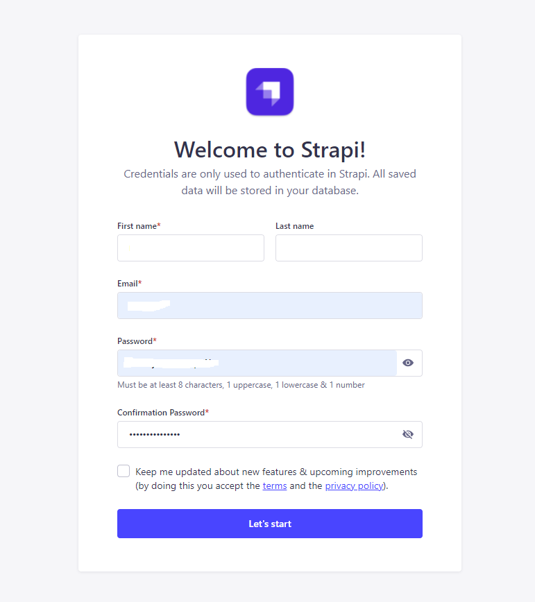
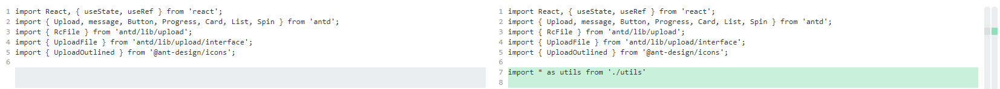
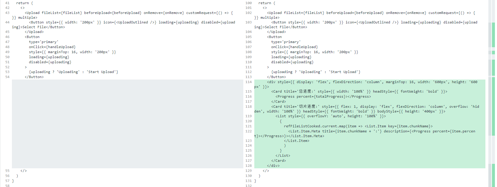

# 大文件上传

使用 strapi.js 和 React 实现大文件上传

参考文章

- [「记录优化」我是如何在项目中实现大文件分片上传，暂停续传的](https://juejin.cn/post/6982877680068739085)
- [字节跳动面试官：请你实现一个大文件上传和断点续传](https://juejin.cn/post/6844904046436843527)
- [字节跳动面试官，我也实现了大文件上传和断点续传](https://juejin.cn/post/6844904055819468808)

## 大致流程

1. 前端接收BGM并进行`切片`
2. 将每份`切片`都进行`上传`
3. 后端接收到所有`切片`，创建一个`文件夹`存储这些`切片`
4. 后端将此`文件夹`里的所有切片合并为完整的BGM文件
5. 删除`文件夹`，因为`切片`不是我们最终想要的，可`删除`（可以保留进行大文件分片下载吗？）
6. 当服务器已存在某一个文件时，再上传需要实现`“秒传”`

[示例文件下载](https://internal-api-drive-stream.feishu.cn/space/api/box/stream/download/all/boxcnZ34jCyQziXxsS9NaV0zfre/?mount_point=explorer)

## 起步

创建一个strapi后端项目

```bash
yarn create strapi-app backend --quickstart
```

依赖有可能因为缺失 `python` 安装失败，可以去[官网下载安装](https://www.python.org/downloads/)

创建一个React前端项目

```bash
yarn create react-app frontend --template typescript
cd frontend
yarn add antd axios
```

## 实现

### 前端实现切片

在浏览器中上传文件时，选中文件后这个文件转成一个Blob对象，而这个对象的原型上上有一个slice方法，
这个方法是大文件能够切片的原理，可以利用这个方法来给打文件切片

> 基础知识
> file对象属性
>
> - size 表示二进制对象的大小
> - type 表示二进制对象的类型
> - slice 方法 分割文件
>
> file.slice（startByte,endByte）
>
> - 第一个参数startByte表示文件起始读取Byte字节
> - 第二个参数则是结束读取字节

`frontend/src/App.tsx`

```tsx
import React, { useState, useRef } from 'react';
import { Upload, message, Button, Progress, Card, List, Spin } from 'antd';
import { RcFile } from 'antd/lib/upload';
import { UploadFile } from 'antd/lib/upload/interface';
import { UploadOutlined } from '@ant-design/icons';

import './App.css';

function createChunk(file: RcFile, size = 5 * 1024 * 1024) {
  const chunkList: {
    file: Blob;
  }[] = []
  let cur = 0
  while (cur < file.size) {
    chunkList.push({ file: file.slice(cur, cur + size) }) // 使用slice方法切片
    cur += size
  }
  return chunkList
}

const UpLoadComponent = () => {
  const [uploading, setuploading] = useState(false)
  const [fileList, setfileList] = useState<RcFile[]>([])
  const beforeUpload = (selectFile: RcFile, selectFileList: RcFile[]) => { // 选中文件
    setfileList([...fileList, ...selectFileList])
  };
  const onRemove = (file: UploadFile) => { // 移除选中
    const index = fileList.indexOf(file as RcFile);
    const newFileList = fileList.slice();
    newFileList.splice(index, 1);
    setfileList(newFileList)
  }
  const handleUpload = () => { // 正式上传
    if (!fileList.length) return
    fileList.forEach(fileItem => {
      const chunkList = createChunk(fileItem)
      console.log(`handleUpload -> ${fileItem.name} chunkList -> `, chunkList) // 看看chunkList长什么样子
    })
  }

  return (
    <>
      <Upload fileList={fileList} beforeUpload={beforeUpload} onRemove={onRemove} customRequest={() => { }} multiple>
        <Button style={{ width: '200px' }} icon={<UploadOutlined />} loading={uploading} disabled={uploading}>Select File</Button>
      </Upload>
      <Button
        type='primary'
        onClick={handleUpload}
        style={{ marginTop: 16, width: '200px' }}
        loading={uploading}
        disabled={uploading}
      >
        {uploading ? 'Uploading' : 'Start Upload'}
      </Button>
    </>
  )
}

function App() {
  return (
    <div className='App'>
      <header className='App-header'>
        <UpLoadComponent></UpLoadComponent>
      </header>
    </div>
  );
}

export default App;

```

引入一下antd

`frontend/src/index.css`

```css
+ @import '~antd/dist/antd.css';
```

选中一个157MB的文件，被切成32个5MB的分片


### 上传切片并展示进度条

先准备一下服务端接口

#### 服务端

进入 `backend` 目录

1.启动

先修改一下跨域配置

`backend/config/middlewares.js`

```js
module.exports = [
  'strapi::errors',
  {
    name: 'strapi::security',
    config: {
      contentSecurityPolicy: {
        directives: {
          'img-src': ['https:', 'http:'],
        },
      },
    },
  },
  {
    name: 'strapi::cors',
    config: {
      enabled: true,
      header: '*',
      origin: ['http://localhost:1337', 'http://localhost:3000']
    }
  },
  'strapi::poweredBy',
  'strapi::logger',
  'strapi::query',
  'strapi::body',
  'strapi::session',
  'strapi::favicon',
  'strapi::public',
];
```

启动服务端

```bash
yarn develop
```

启动成功后可以访问 `http://localhost:1337/admin` 进入strapi后台管理页面

2.注册

首次进入后台可以注册管理员



3.创建一个表准备用来管理大文件上传

在 `strapi内容类型构建器` 中，管理员可以创建和管理内容类型：集合类型和单一类型以及组件。
集合类型是可以管理多个条目的内容类型。
单一类型是只能管理一个条目的内容类型。
组件是一种可用于多种集合类型和单一类型的数据结构。
创建 `strapi内容类型` 同时会生成一套增删查改接口、创建数据库表。
我们要建一个叫 `bigfile` 的 `内容类型`。点击左侧菜单 `Content Type Builder` ，然后点击 `Create new collection type` ，输入名字


`strapi` 会默认带上一个 `起草/发布` 系统，这次不需要把它关了


给表添加一些字段，用来存储上传的文件信息


点击右上角 `save` 按钮保存，我们会看到代码中多了一些文件


4.了解一下 `strapi` 自带的上传功能

我们准备写一个上传接口，在这之前可以先了解一下 `strapi` 自带的上传功能
`strapi` 利用插件系统集成了上传功能 [plugin-upload](https://docs.strapi.io/developer-docs/latest/plugins/upload.html#configuration)

点击后台左侧菜单的 `Media Library`


当上传一张图片后可以看到在 `backend/public/uploads` 下多了一些图片文件


我们在 `public/uploads` 目录下创建 `bigfile/chunk` 文件夹用来存放大文件切片

5.编写文件上传接口

`strapi` 是基于 `Koa` Node.js框架构建的，我们写接口的方式跟 [Koa](https://www.ruanyifeng.com/blog/2017/08/koa.html) 差不多。
Koa 提供一个 Context 对象，表示一次对话的上下文（包括 HTTP 请求和 HTTP 回复）。
通过阅读 `strapi` 自带上传功能的代码 `backend/node_modules/@strapi/plugin-upload/server/controllers/content-api.js`，
可以知道 `ctx.request.files` 可以获得上传的文件对象
然后我们利用 Node.js工具库 [fs-extra](https://github.com/jprichardson/node-fs-extra) 把文件保存到指定目录

我们先写 bigfile 的 `controllers`

> 控制器是 JavaScript 文件，其中包含一组方法，称为操作，由客户端根据请求的路由访问。每当客户端请求路由时，操作都会执行业务逻辑代码并发回响应。控制器代表模型-视图-控制器 (MVC) 模式中的 C。[文档地址](https://docs.strapi.io/developer-docs/latest/development/backend-customization/controllers.html)

`backend/src/api/bigfile/controllers/bigfilejs`

```js
'use strict'

/**
 *  bigfile controller
 */

const { createCoreController } = require('@strapi/strapi').factories
const _ = require('lodash')
const utils = require('@strapi/utils')
const path = require('path')
const fse = require('fs-extra')
const UPLOAD_DIR = path.resolve(__dirname, '../../../../public/uploads/bigfile/chunk') // 切片存储目录

module.exports = createCoreController('api::bigfile.bigfile', ({ strapi }) => ({
    async upload (ctx) {
        const {
            request: { files: { file = {} } },
        } = ctx
        const { fileName, chunkName } = ctx.request.body
        strapi.log.info(`>>> bigfile upload -> file.size, fileName, chunkName -> ${file.size}, ${fileName}, ${chunkName}`)
        if (_.isEmpty(file) || file.size === 0) {
            return new utils.errors.ValidationError('Files are empty')
        }
        const chunkDir = path.resolve(UPLOAD_DIR, `${fileName}-chunks`) // 保存切片的文件夹的路径
        if (!fse.existsSync(chunkDir)) { // 切片目录不存在，创建切片目录
            await fse.mkdirs(chunkDir)
        }
        await fse.move(file.path, `${chunkDir}/${chunkName}`, {
            overwrite: true
        }) // 把切片移动到切片文件夹

        return {
            code: 0,
            errMessage: ''
        }
    },
}))
```

接着补充一下路由信息

> 在任何 URL 上发送到 Strapi 的请求都由路由处理。[文档地址](https://docs.strapi.io/developer-docs/latest/development/backend-customization/routes.html)

`backend/src/api/bigfile/routes/bigfilejs`

```js
'use strict';

/**
 * bigfile router.
 */

module.exports = {
    routes: [
        { // Path defined with a URL parameter
            method: 'POST',
            path: '/bigfile/upload',
            handler: 'bigfile.upload',
            config: {
                auth: false,
            },
        }
    ]
}
```

`strapi` 还自带一个权限系统，接口默认是不给访问的，为了前端对接简单我们要给 `public` 开放权限


#### 前端

封装一个 `axios`上传请求方法 和 并发控制方法

`frontend/src/utils.ts`

```ts
import axios, { AxiosRequestConfig } from 'axios';
import { useState, useRef, useEffect } from 'react'

export function axiosUpload(
    url: string,
    data: FormData,
    onUploadProgress: AxiosRequestConfig['onUploadProgress'], // 进度回调
) {
    return new Promise((resolve, reject) => {
        axios({
            url,
            method: 'POST',
            data,
            onUploadProgress, // 传入监听进度回调
        })
            .then((res) => {
                resolve(res);
            })
            .catch((err) => {
                reject(err);
            });
    });
}

export function asyncPool(arr: any, max = 2, callback = () => { }) {
    let promiseArr: Promise<any>[] = [] // 存储并发max的promise数组
    let i = 0
    async function runOne() {
        if (i === arr.length) { return } // 所有请求都处理完
        let one = arr[i++]() // 执行一个函数,i++，保存fetch返回的promise
        promiseArr.push(one) // // 将当前promise存入并发数组
        one.then(() => { // 当promise执行完毕后，从数组删除
            promiseArr.splice(promiseArr.indexOf(one), 1);
        });

        if (promiseArr.length >= max) { // 如果当并行数量达到最大
            await Promise.race(promiseArr).then(runOne) // 用race等队列里有promise完成了才调用runOne
        } else {
            // 否则直接调用runOne让下一个并发入列
            await runOne()
        }
    }

    runOne().then(() => Promise.all(promiseArr)).then(() => { // arr循环完后 现在promiseArr里面剩下最后max个promise对象 使用all等待所有的都完成之后执行callback
        callback()
    })
}
```

接写来修改一下 `frontend/src/App.tsx`

引入工具类


修改 handleUpload 方法，在调用服务端接口前先处理一下文件切片信息以支持进度条展示


实现上传切片文件，我们实现的后端接口地址是 `http://localhost:1337/api/bigfile/upload`

```tsx
  function uploadChunks() {
    setuploading(true)
    const requestList = refFileListCooked.current
      .map(({ file, fileName, chunkName }) => {
        const formData = new FormData();
        formData.append('file', file);
        formData.append('fileName', fileName);
        formData.append('chunkName', chunkName);
        return { formData };
      })
      .map(({ formData }, index) =>
        () => utils.axiosUpload(
          'http://localhost:1337/api/bigfile/upload',
          formData,
          (progressEvent: typeProgressEvent) => progressHandler(progressEvent, refFileListCooked.current[index]), // 传入监听上传进度回调
        )
      )
    utils.asyncPool(requestList, 5, () => {
      setuploading(false)
      message.success('上传成功')
    }) // 限制并发请求数量
  }
  function progressHandler(progressEvent: typeProgressEvent, fileListCookedItem: typeFileListCookedItem) {
    fileListCookedItem.percent = Math.floor((progressEvent.loaded / progressEvent.total) * 100)
    settotalProgress(
      Math.floor(
        refFileListCooked.current.reduce((acc, cur) => acc + cur.percent, 0) / refFileListCooked.current.length
      )
    )
  }
```

最后写一下进度条UI


完整的 `frontend/src/App/tsx` 如下

```tsx
import React, { useState, useRef } from 'react';
import { Upload, message, Button, Progress, Card, List, Spin } from 'antd';
import { RcFile } from 'antd/lib/upload';
import { UploadFile } from 'antd/lib/upload/interface';
import { UploadOutlined } from '@ant-design/icons';

import * as utils from './utils'

import './App.css';

function createChunk(file: RcFile, size = 5 * 1024 * 1024) {
  const chunkList: {
    file: Blob;
  }[] = []
  let cur = 0
  while (cur < file.size) {
    chunkList.push({ file: file.slice(cur, cur + size) }) // 使用slice方法切片
    cur += size
  }
  return chunkList
}

const UpLoadComponent = () => {
  const [uploading, setuploading] = useState(false)
  const [fileList, setfileList] = useState<RcFile[]>([])
  const beforeUpload = (selectFile: RcFile, selectFileList: RcFile[]) => { // 选中文件
    setfileList([...fileList, ...selectFileList])
  };
  const onRemove = (file: UploadFile) => { // 移除选中
    const index = fileList.indexOf(file as RcFile);
    const newFileList = fileList.slice();
    newFileList.splice(index, 1);
    setfileList(newFileList)
  }

  type typeFileListCookedItem = {
    file: Blob
    size: number
    percent: number
    chunkName: string
    fileName: string
  }
  type typeProgressEvent = {
    total: number
    loaded: number
  }
  const refFileListCooked = useRef<typeFileListCookedItem[]>([])
  const [totalProgress, settotalProgress] = useState(0)
  const handleUpload = () => { // 正式上传
    if (!fileList.length) return
    refFileListCooked.current = []
    settotalProgress(0)
    fileList.forEach(fileItem => {
      const chunkList = createChunk(fileItem)
      console.log(`handleUpload -> ${fileItem.name} chunkList -> `, chunkList) // 看看chunkList长什么样子
      refFileListCooked.current.push( // 处理切片信息
        ...chunkList.map(({ file }, index) => ({
          file,
          size: file.size,
          percent: 0,
          chunkName: `${fileItem.name}-${index}`,
          fileName: fileItem.name,
        }))
      )
    })
    uploadChunks() // 执行上传切片的操作
  }

  function uploadChunks() {
    setuploading(true)
    const requestList = refFileListCooked.current
      .map(({ file, fileName, chunkName }) => {
        const formData = new FormData();
        formData.append('file', file);
        formData.append('fileName', fileName);
        formData.append('chunkName', chunkName);
        return { formData };
      })
      .map(({ formData }, index) =>
        () => utils.axiosUpload(
          'http://localhost:1337/api/bigfile/upload',
          formData,
          (progressEvent: typeProgressEvent) => progressHandler(progressEvent, refFileListCooked.current[index]), // 传入监听上传进度回调
        )
      )
    utils.asyncPool(requestList, 5, () => {
      setuploading(false)
      message.success('上传成功')
    }) // 限制并发请求数量
  }

  function progressHandler(progressEvent: typeProgressEvent, fileListCookedItem: typeFileListCookedItem) {
    fileListCookedItem.percent = Math.floor((progressEvent.loaded / progressEvent.total) * 100)
    settotalProgress(
      Math.floor(
        refFileListCooked.current.reduce((acc, cur) => acc + cur.percent, 0) / refFileListCooked.current.length
      )
    )
  }

  return (
    <>
      <Upload fileList={fileList} beforeUpload={beforeUpload} onRemove={onRemove} customRequest={() => { }} multiple>
        <Button style={{ width: '200px' }} icon={<UploadOutlined />} loading={uploading} disabled={uploading}>Select File</Button>
      </Upload>
      <Button
        type='primary'
        onClick={handleUpload}
        style={{ marginTop: 16, width: '200px' }}
        loading={uploading}
        disabled={uploading}
      >
        {uploading ? 'Uploading' : 'Start Upload'}
      </Button>
      <div style={{ display: 'flex', flexDirection: 'column', marginTop: 16, width: '600px', height: '600px' }}>
        <Card title='总进度:' style={{ width: '100%' }} headStyle={{ fontWeight: 'bold' }}>
          <Progress percent={totalProgress}></Progress>
        </Card>
        <Card title='切片进度:' style={{ flex: 1, display: 'flex', flexDirection: 'column', overflow: 'hidden', width: '100%' }} headStyle={{ fontWeight: 'bold' }} bodyStyle={{ height: '400px' }}>
          <List style={{ overflowY: 'auto', height: '100%' }}>
            {
              refFileListCooked.current.map(item => <List.Item key={item.chunkName}>
                <List.Item.Meta title={item.chunkName + ':'} description={<Progress percent={item.percent}></Progress>}></List.Item.Meta>
              </List.Item>
              )
            }
          </List>
        </Card>
      </div>
    </>
  )
}

function App() {
  return (
    <div className='App'>
      <header className='App-header'>
        <UpLoadComponent></UpLoadComponent>
      </header>
    </div>
  );
}

export default App;

```

选择一个视频上传一下
可以看到后台指定目录多了一堆文件


### 合并切片

现在我们已经可以保存所有切片了，接下来就要开始合并切片，前端会发一个/merge请求，叫后端合并这些切片

服务端处理

我们在 `public/uploads` 目录下创建 `bigfile/megre` 文件夹用来存放合并的大文件
在 `bigfile` 的 `controller` 里面加一个 `merge` 方法

`backend/src/api/bigfile/controllers/bigfile.js`

```js
const UPLOAD_DIR_MEGRE = path.resolve(__dirname, '../../../../public/uploads/bigfile/megre') // 切片存储目录
...
    async megre (ctx) {
        const pipeStream = (path, writeStream) => {
            return new Promise(resolve => {
                const readStream = fse.createReadStream(path)
                readStream.on('end', () => {
                    fse.unlinkSync(path)
                    resolve()
                })
                readStream.pipe(writeStream)
            })
        }

        const mergeFileChunk = async (fileName, chunkSize) => { // 合并切片
            let chunkPaths = null
            const chunkDir = path.resolve(UPLOAD_DIR, `${fileName}-chunks`)
            chunkPaths = await fse.readdir(chunkDir) // 获取切片文件夹里所有切片，返回一个数组
            // 根据切片下标进行排序 否则直接读取目录的获得的顺序可能会错乱
            chunkPaths.sort((a, b) => a.split('-')[1] - b.split('-')[1])
            const arr = chunkPaths.map((chunkPath, index) => {
                return pipeStream(
                    path.resolve(chunkDir, chunkPath),
                    // 指定位置创建可写流
                    fse.createWriteStream(path.resolve(UPLOAD_DIR_MEGRE, fileName), {
                        start: index * chunkSize,
                        end: (index + 1) * chunkSize,
                    })
                )
            })
            await Promise.all(arr)
            fse.rmdirSync(chunkDir) // 合并后删除保存切片的目录
        }

        const { fileName, size, chunkSize } = ctx.request.body
        await mergeFileChunk(fileName, chunkSize)
    }
...
```

`backend/src/api/bigfile/routes/bigfile.js`

```js
        {
            method: 'POST',
            path: '/bigfile/megre',
            handler: 'bigfile.megre',
            config: {
                auth: false,
            },
        }
```

同样的给 `public` 开放权限


前端处理

在 `frontend/src/App.tsx` 中引入 `axios`
改写上传切片方法，等切片都上传完后调用一下 `megre` api

完整代码如下

```tsx
import React, { useState, useRef } from 'react';
import { Upload, message, Button, Progress, Card, List, Spin } from 'antd';
import { RcFile } from 'antd/lib/upload';
import { UploadFile } from 'antd/lib/upload/interface';
import { UploadOutlined } from '@ant-design/icons';
import axios from 'axios'

import * as utils from './utils'

import './App.css';

function createChunk(file: RcFile, size = 5 * 1024 * 1024) {
  const chunkList: {
    file: Blob;
  }[] = []
  let cur = 0
  while (cur < file.size) {
    chunkList.push({ file: file.slice(cur, cur + size) }) // 使用slice方法切片
    cur += size
  }
  return chunkList
}

const UpLoadComponent = () => {
  const [uploading, setuploading] = useState(false)
  const [fileList, setfileList] = useState<RcFile[]>([])
  const beforeUpload = (selectFile: RcFile, selectFileList: RcFile[]) => { // 选中文件
    setfileList([...fileList, ...selectFileList])
  };
  const onRemove = (file: UploadFile) => { // 移除选中
    const index = fileList.indexOf(file as RcFile);
    const newFileList = fileList.slice();
    newFileList.splice(index, 1);
    setfileList(newFileList)
  }

  type typeFileListCookedItem = {
    file: Blob
    size: number
    percent: number
    chunkName: string
    fileName: string
  }
  type typeProgressEvent = {
    total: number
    loaded: number
  }
  const refFileListCooked = useRef<typeFileListCookedItem[]>([])
  const [totalProgress, settotalProgress] = useState(0)
  const handleUpload = () => { // 正式上传
    if (!fileList.length) return
    refFileListCooked.current = []
    settotalProgress(0)
    fileList.forEach(fileItem => {
      const chunkList = createChunk(fileItem)
      console.log(`handleUpload -> ${fileItem.name} chunkList -> `, chunkList) // 看看chunkList长什么样子
      refFileListCooked.current.push( // 处理切片信息
        ...chunkList.map(({ file }, index) => ({
          file,
          size: file.size,
          percent: 0,
          chunkName: `${fileItem.name}-${index}`,
          fileName: fileItem.name,
        }))
      )
    })
    uploadChunks() // 执行上传切片的操作
  }

  function uploadChunks() {
    setuploading(true)
    const requestList = refFileListCooked.current
      .map(({ file, fileName, chunkName }) => {
        const formData = new FormData();
        formData.append('file', file);
        formData.append('fileName', fileName);
        formData.append('chunkName', chunkName);
        return { formData };
      })
      .map(({ formData }, index) =>
        () => utils.axiosUpload(
          'http://localhost:1337/api/bigfile/upload',
          formData,
          (progressEvent: typeProgressEvent) => progressHandler(progressEvent, refFileListCooked.current[index]), // 传入监听上传进度回调
        )
      )
    utils.asyncPool(requestList, 5, async () => {
      const res = await Promise.allSettled(
        fileList.map(
          fileItem => axios({
            url: 'http://localhost:1337/api/bigfile/megre',
            method: 'POST',
            data: { fileName: fileItem.name, size: fileItem.size, chunkSize: 5 * 1024 * 1024 },
          })
        )
      )
      const success = res.reduce((prev, cur) => {
        console.log('uploadChunks megre res -> ',cur)
        if (cur.status === 'fulfilled' && cur.value.data.code === 0) {
          prev += 1
        }
        return prev
      }, 0)
      message.success(`上传成功${success}个，失败${fileList.length - success}个`)
      setuploading(false)
      setfileList([])
    }) // 限制并发请求数量
  }

  function progressHandler(progressEvent: typeProgressEvent, fileListCookedItem: typeFileListCookedItem) {
    fileListCookedItem.percent = Math.floor((progressEvent.loaded / progressEvent.total) * 100)
    settotalProgress(
      Math.floor(
        refFileListCooked.current.reduce((acc, cur) => acc + cur.percent, 0) / refFileListCooked.current.length
      )
    )
  }

  return (
    <>
      <Upload fileList={fileList} beforeUpload={beforeUpload} onRemove={onRemove} customRequest={() => { }} multiple>
        <Button style={{ width: '200px' }} icon={<UploadOutlined />} loading={uploading} disabled={uploading}>Select File</Button>
      </Upload>
      <Button
        type='primary'
        onClick={handleUpload}
        style={{ marginTop: 16, width: '200px' }}
        loading={uploading}
        disabled={uploading}
      >
        {uploading ? 'Uploading' : 'Start Upload'}
      </Button>
      <div style={{ display: 'flex', flexDirection: 'column', marginTop: 16, width: '600px', height: '600px' }}>
        <Card title='总进度:' style={{ width: '100%' }} headStyle={{ fontWeight: 'bold' }}>
          <Progress percent={totalProgress}></Progress>
        </Card>
        <Card title='切片进度:' style={{ flex: 1, display: 'flex', flexDirection: 'column', overflow: 'hidden', width: '100%' }} headStyle={{ fontWeight: 'bold' }} bodyStyle={{ height: '400px' }}>
          <List style={{ overflowY: 'auto', height: '100%' }}>
            {
              refFileListCooked.current.map(item => <List.Item key={item.chunkName}>
                <List.Item.Meta title={item.chunkName + ':'} description={<Progress percent={item.percent}></Progress>}></List.Item.Meta>
              </List.Item>
              )
            }
          </List>
        </Card>
      </div>
    </>
  )
}

function App() {
  return (
    <div className='App'>
      <header className='App-header'>
        <UpLoadComponent></UpLoadComponent>
      </header>
    </div>
  );
}

export default App;

```

再上传一次文件，可以看到完整的文件出现在了指定目录


### 文件列表

现在我们加一个小功能，就是把上传文件的记录存到数据库，
前端就可以请求文件列表，下载服务端上的文件

依旧先处理服务端

`Strapi` 提供建立在查询引擎 API 之上的实体服务 API。实体服务是处理 Strapi 的复杂数据结构（如组件和动态区域）的层，
并在底层使用查询引擎 API 来执行数据库查询。[指南](https://docs.strapi.io/developer-docs/latest/developer-resources/database-apis-reference/entity-service-api.html)
我们改一下 `megre` 方法，利用 `strapi` 提供的API往数据库里存数据
`backend/src/api/bigfile/controllers/bigfile/js`


`strapi内容类型` 自带核心路由器（即 find、findOne、create、update 和 delete）对应于 Strapi 在创建新内容类型时自动创建的默认路由，同样的也有默认控制器和操作，
所以我们可以白嫖一个查询列表接口
`backend/src/api/bigfile/routes/bigfile/js`

```js
        {
            method: 'GET',
            path: `/bigfiles`,
            handler: `bigfile.find`,
            config: {},
        },
```

接口开放权限


前端对接文件列表接口，写一个 `文件列表组件` ，需要用到新依赖 `ahooks`

```bash
yarn add ahooks eventemitter3
```

对接 `strapi` 接口
`frontend/src/strapiApi.ts`

```ts
import qs from 'qs'
import axios from 'axios'

export type typePagination = {
    page: number, pageSize: number
}

export type typeStrapiFind<T> = {
    data: T[],
    meta: {
        pagination: {
            page: number,
            pageCount: number,
            pageSize: number,
            total: number
        }
    }
}

export type typeStrapiEntity<T> = {
    attributes: T & {
        createdAt: string,
        updatedAt: string,
        publishedAt?: string,
    }
    id: number
}

type typeStrapiEntityBigfile = typeStrapiEntity<{
    text: string
}>
export const strapiNoticeList = async (
    { page, pageSize }:
        Partial<typePagination>
): Promise<typeStrapiFind<typeStrapiEntityBigfile>> => {
    const queryOption = {
        populate: '*',
        pagination: {
            page: page || 1,
            pageSize: pageSize || 10
        },
        sort: ['createdAt:desc']
    }
    const query = qs.stringify(queryOption, {
        encodeValuesOnly: true
    })
    const res = await axios.request<typeStrapiFind<typeStrapiEntityBigfile>>({
        url: `http://localhost:1337/api/bigfiles?${query}`
    })
    return res.data
}
```

`App.tsx` 中导入api文件， 写一个文件列表组件


```tsx
const BigfileList = ({ eventBus }: { eventBus: EventEmitter<any> }) => {
  const [visible, setVisible] = useState(false)
  const showDrawer = () => {
    setVisible(true)
  }
  const onClose = () => {
    setVisible(false)
  }
  const { tableProps } = useAntdTable(
    ({ current, pageSize }) =>
      strapiApi.strapiNoticeList({ page: current, pageSize })
        .then(res => ({
          list: res.data.map(item => ({
            id: item.id,
            ...item.attributes
          })),
          total: res.meta.pagination.total
        }))
  )

  eventBus.useSubscription((val) => {
    console.log(val)
    if(val?.type === 'uploaded') {
      tableProps.onChange({ current: 1 })
    }
  })

  const columns = [
    {
      title: 'id',
      dataIndex: ['id'],
    },
    {
      title: 'fileName',
      dataIndex: 'fileName',
    },
    {
      title: 'actioin',
      key: 'action',
      render: (text: any, record: any) => (
        <a style={{ color: '#40a9ff' }} href={'http://localhost:1337' + record.filePath}>下载</a>
      ),
    },
  ]

  return (
    <>
      <UnorderedListOutlined
        onClick={showDrawer}
        style={{ position: 'absolute', top: '50px', right: '50px', fontSize: '30px', color: '#FFFFFF' }}
      />
      <Drawer title='文件列表' placement='right' onClose={onClose} visible={visible}>
        <Table columns={columns} rowKey='id' {...tableProps} style={{ height: '100%' }} />
      </Drawer>
    </>
  )
}
```


把服务端之前上传的文件都删了，再前端重新上传一遍

可以看到文件列表已经好了
